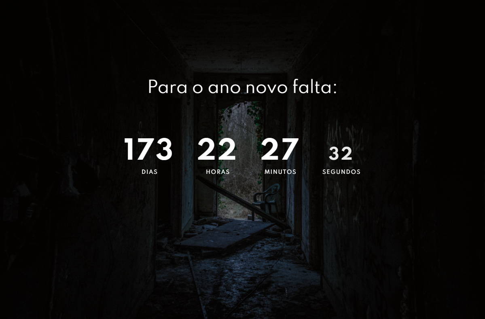

# new-year-countdown

A countdown showing how many days to the end of the year.
 
# Technologies

In this project, I used React(create-react-app) and SASS.

I learned more about Hooks as useState, useEffect, and figure out a little more about how that works React.
 

[This video was my inspiration to implement that app.](https://youtu.be/dtKciwk_si4).

## Result

> ### See the result live [here](https://new-year-countdown-lusk1nha.vercel.app/)

Image -

